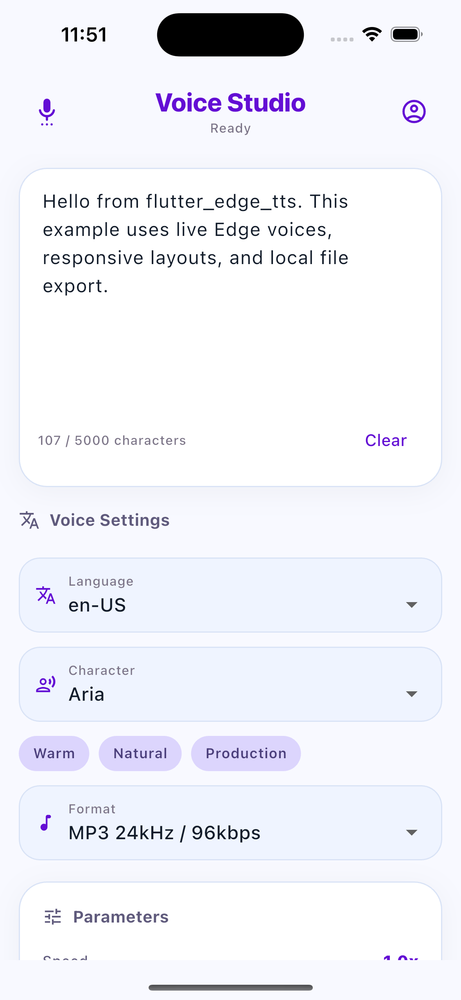
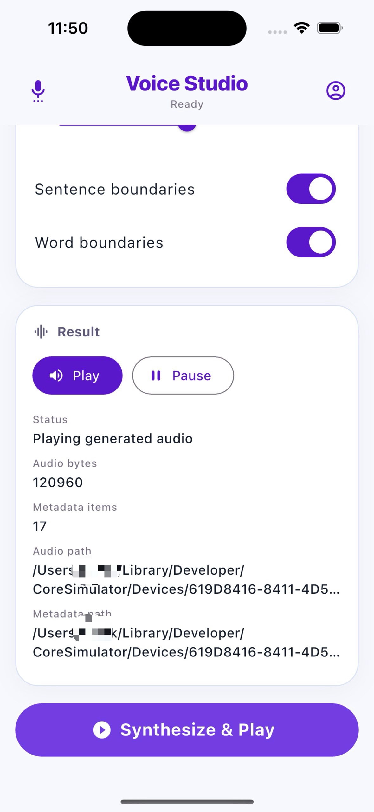
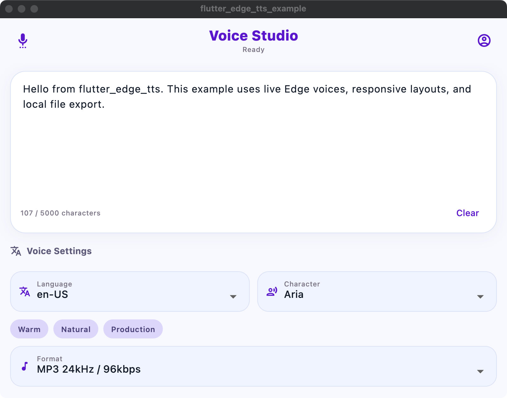
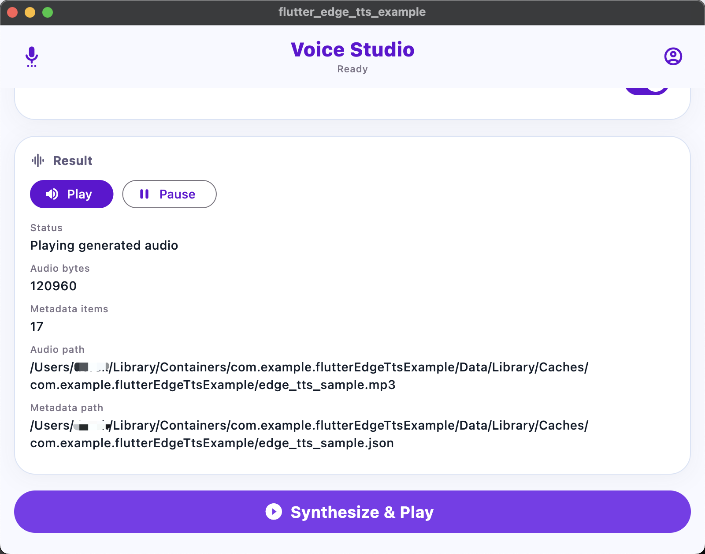

# flutter_edge_tts

[](https://github.com/Moosphan/flutter_edge_tts/releases)
[](LICENSE)
[](#platform-support)

<table>
  <tr>
    <td><strong>English</strong></td>
    <td><a href="README.zh-CN.md">中文</a></td>
  </tr>
</table>

**A free Flutter TTS package powered by Microsoft Edge online speech synthesis.**

`flutter_edge_tts` provides a shared Dart synthesis layer for Android, iOS, macOS, Windows, and Linux, with a consistent API for voice discovery, text and SSML synthesis, file output, and synthesis metadata.

## Features

- Free and open-source Flutter TTS package
- Shared Dart implementation for mobile and desktop Flutter apps
- Live voice discovery from the Microsoft Edge online speech synthesis endpoint
- Supports text synthesis to bytes, files, or stream events
- Supports raw SSML synthesis
- Supports optional sentence and word boundary metadata
- Supports multiple output formats including MP3, WebM, Ogg, PCM, and WAV
- As of 2026-06-03, the live endpoint returns 322 voices across 142 locales and 75 languages

## Platform support

- Android
- iOS
- macOS
- Windows
- Linux

## Preview

<table>
  <tr>
    <td align="center"><strong>Mobile</strong></td>
    <td align="center"><strong>Desktop</strong></td>
  </tr>
  <tr>
    <td>
      
      
    </td>
    <td>
      <br>
      
    </td>
  </tr>
</table>

## Installation

```yaml
dependencies:
  flutter_edge_tts: ^0.0.1
```

```bash
flutter pub get
```

## Quick start

```dart
import 'package:flutter_edge_tts/flutter_edge_tts.dart';

final tts = FlutterEdgeTts(
  voice: 'en-US-AriaNeural',
  outputFormat: EdgeTtsOutputFormat.audio24Khz96KbitrateMonoMp3,
);

final result = await tts.synthesize('Hello from Flutter.');
print(result.audioBytes.length);

await tts.close();
```

## Core API

### Load voices

```dart
final voices = await tts.getVoices();
print(voices.first.shortName);
```

### Synthesize text

```dart
final result = await tts.synthesize(
  'Hello from Flutter.',
  prosody: const EdgeTtsProsody(
    rate: '1.05',
    pitch: '+10Hz',
    volume: '100',
  ),
);
```

### Synthesize to files

```dart
final result = await tts.synthesizeToFile(
  'Hello from Flutter.',
  audioFilePath: '/tmp/edge.mp3',
  metadataFilePath: '/tmp/edge.json',
);
```

### Stream synthesis events

```dart
final stream = tts.synthesizeStream(
  'Hello from Flutter.',
  prosody: const EdgeTtsProsody(rate: '1.1', pitch: '+20Hz'),
);

await for (final event in stream) {
  if (event is EdgeTtsAudioChunkEvent) {
    print(event.chunk.length);
  } else if (event is EdgeTtsMetadataEvent) {
    print(event.metadata.items.length);
  }
}
```

### Synthesize raw SSML

```dart
final ssml = '''
<speak version="1.0" xmlns="http://www.w3.org/2001/10/synthesis" xml:lang="en-US">
  <voice name="en-US-AriaNeural">
    <prosody rate="1.05" pitch="+10Hz">
      Hello from raw SSML.
    </prosody>
  </voice>
</speak>
''';

final result = await tts.synthesizeSsml(ssml);
```

## Configuration

```dart
final tts = FlutterEdgeTts(
  voice: 'en-US-AriaNeural',
  voiceLocale: 'en-US',
  outputFormat: EdgeTtsOutputFormat.audio24Khz96KbitrateMonoMp3,
  enableSentenceBoundary: true,
  enableWordBoundary: true,
);
```

```dart
tts.updateConfig(
  tts.config.copyWith(
    voice: 'en-GB-SoniaNeural',
    enableWordBoundary: true,
  ),
);
```

## Voice naming and compatibility

Common voice names look like:

- `en-US-AriaNeural`
- `en-US-AndrewMultilingualNeural`

The locale prefix identifies the primary locale of the voice. The package uses this naming pattern to infer a default `voiceLocale` when one is not provided explicitly.

The broader Microsoft Azure Speech ecosystem includes voice families such as `Neural`, `MultilingualNeural`, `Neural HD`, and `MAI-Voice-1`. This package is implemented around the Edge Read Aloud style transport path rather than the full Azure Speech SDK surface, so standard neural voices are the safest default choice. Advanced Azure-only voice families should be validated in your own environment before being exposed as supported options.

For production integrations, prefer voices returned by `getVoices()` over hard-coded assumptions.

## Metadata

When sentence or word boundary metadata is enabled, synthesis can return structured metadata alongside audio. This is useful for read-along highlighting, subtitle timing, accessibility flows, and language learning interfaces.

## Example app

A runnable demo app is included in [example/lib/main.dart](example/lib/main.dart). It demonstrates voice loading, voice selection, output format selection, metadata toggles, and file synthesis.

## Notes

- The high-level text API escapes text by default. Raw SSML should still be XML-safe.
- Audio playback is intentionally left to the host app.
- Voice and language counts come from the live endpoint and may change over time.
- Upstream service behavior can change over time. If request headers, websocket framing, or voice endpoints change, the package may need to be updated.

## Release checklist

- Update the package version and `CHANGELOG.md`
- Confirm `homepage`, `repository`, and `issue_tracker` in `pubspec.yaml`
- Add screenshots under `doc/images/`
- Run `flutter analyze`
- Run `flutter test`
- Run the example app on Android, iOS, macOS, Windows, and Linux
- Validate a few live voices returned by `getVoices()`
- Review README examples against the final public API
- Run `flutter pub publish --dry-run`

## Publish helper

Use the bundled helper to run checks, bypass local mirror variables, and publish to the official `pub.dev` registry:

```bash
./scripts/publish.sh
```

On macOS, the script can auto-detect the current system HTTP/HTTPS proxy. If you want to override it manually:

```bash
./scripts/publish.sh --proxy http://127.0.0.1:7890
```

## Project

- Repository: [Moosphan/flutter_edge_tts](https://github.com/Moosphan/flutter_edge_tts)
- Issue tracker: [GitHub Issues](https://github.com/Moosphan/flutter_edge_tts/issues)

## License

[MIT](LICENSE)
